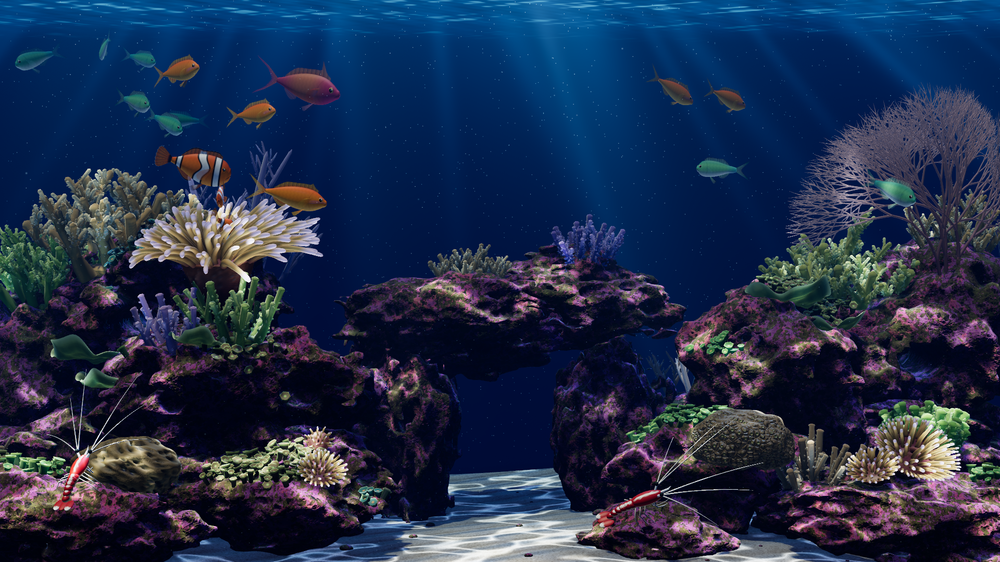
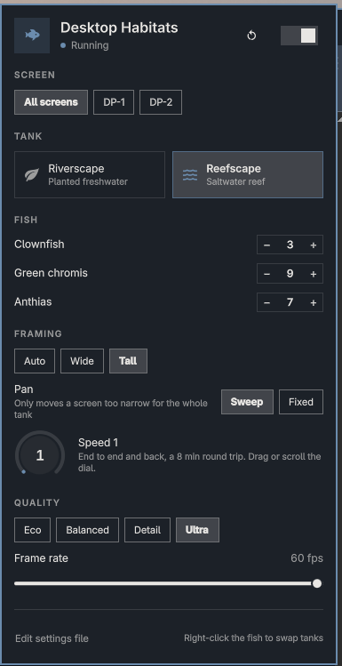

# Desktop Habitats

[](docs/videos/demo.mp4)

A live aquarium wallpaper for [Omarchy](https://omarchy.org), installed as an Omarchy plugin. Forked from the [Mac screensaver](https://github.com/chaseleantj/desktop-habitats) by [chaseleantj](https://github.com/chaseleantj). Choose **Riverscape**, a planted freshwater tank, or **Reefscape**, a saltwater reef. Both are rendered on your GPU with Three.js and WebGL2, sit behind your windows, and are set up from a fish icon in the top bar.



## Install

```sh
omarchy plugin add https://github.com/chrispository/desktop-habitats-omarchy.git --enable
~/.config/omarchy/plugins/chrispository.desktop-habitats/setup
```

The first command adds the fish to the right of your bar. `setup` installs the build dependencies (`qt6-webengine`, `layer-shell-qt`, `cmake`, `ninja`, `base-devel`), builds the wallpaper and starts it. From then on it starts with your session.

## The bar widget



Click the fish in the top bar to open the panel. Right-click it to swap tanks.

- **Switch and restart** (top right): turn the wallpaper on or off, or restart it.
- **Screen**: change all screens at once, or pick one (such as `DP-2`) to switch it off or give it its own settings. **Match all screens** clears them.
- **Tank**: Riverscape or Reefscape.
- **Fish**: how many of each kind. They swim in or leave without a restart.
- **Framing**: *Auto* fits the tank to the screen's shape; *Wide* and *Tall* force one. **Pan** moves the view along the tank on a screen too narrow to show all of it. *Sweep* travels end to end, at a speed set with the dial. *Fixed* holds it where you put the slider.
- **Quality**: Eco, Balanced, Detail or Ultra, and the frame rate.
- **Edit settings file** opens `~/.config/desktop-habitats/config.jsonc`, the file the panel writes. Changes made by hand show up right away, and your comments are kept.

For keybindings, the widget takes `omarchy-shell chrispository.desktop-habitats <command>`, where the command is `toggle`, `swapTank`, `setTank reefscape`, `setPan auto` (or -1 to 1), `setPanSpeed 1-10`, `start`, `restart` or `stop`. To start the wallpaper yourself instead of at login, add `"autostart": false` to the widget's entry in `~/.config/omarchy/shell.json`.

## New graphics

- Reefscape's clownfish now live in a rigged host anemone, modelled in Blender with 389 bones. Every tentacle ripples in a wave across the crown, leans with the current, and parts around a clownfish bathing in it.
- **Ultra** quality renders at 60 fps and twice the pixel density. It uses 4K bark and cave rock in Riverscape and sharper shadows in Reefscape.
- Riverscape's broadleaf plants are smaller and flatter, and sit better in the planting.

## Update and uninstall

```sh
omarchy plugin update chrispository.desktop-habitats        # the wallpaper rebuilds itself on its next start
~/.config/omarchy/plugins/chrispository.desktop-habitats/uninstall
```

Uninstalling stops the wallpaper and removes the plugin. Your settings stay in `~/.config/desktop-habitats`.

## Credits and license

[MIT licensed](LICENSE). Three.js 0.180.0 is bundled under its [MIT license](vendor/THREE-LICENSE.txt). Riverscape's sand is [Sand 01](https://polyhaven.com/a/sand_01) from Poly Haven ([CC0](https://polyhaven.com/license)). Its bark is Fab's [Grassland African Tree Bark Wood Rough 04](https://www.fab.com/listings/fe5a998a-ca25-46c1-9420-f8039065b7e3) and its rock is Fab's Cave Rock ([one](https://www.fab.com/listings/4de392b5-2e2c-4025-8667-ae8a95f2293f), [two](https://www.fab.com/listings/e24f6893-548a-45d0-8277-2fa16d67f25d)). Reefscape's rock, textures and creatures are procedural, generated by the scripts in `tools/` and `3d_models/`.
